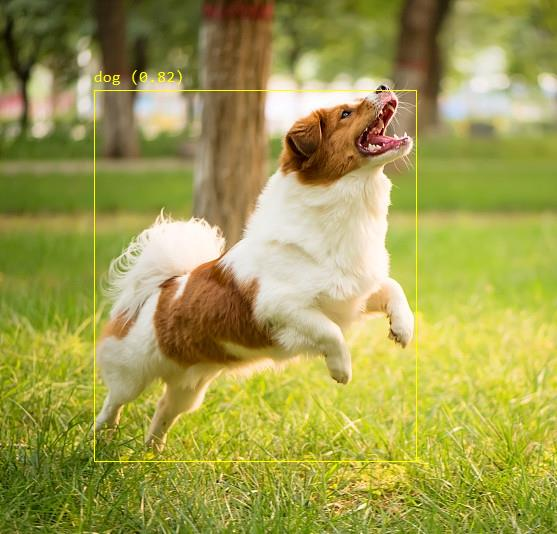

# Yolov8.Net

https://github.com/sstainba/Yolov8.Net

This is a .NET interface for using Yolov5 and Yolov8 models on the ONNX runtime.
At the time this is published, the ONNX Runtime only supports up to Opset 15.
If you are training a custom model, be sure to export the model to the ONNX format with
the --Opset=15 flag.


```csharp
// Create new Yolov8 predictor, specifying the model (in ONNX format)
// If you are using a custom trained model, you can provide an array of labels. Otherwise, the standard Coco labels are used.
using var yolo = new YoloV8Predictor.Create("./assets/yolov8m.onnx");

// Provide an input image.  Image will be resized to model input if needed.
using var image = Image.FromFile("Assets/rufus.jpg");
var predictions = yolo.Predict(image);

// Draw your boxes
using var graphics = Graphics.FromImage(image);
foreach (var pred in predictions)
{
    var originalImageHeight = image.Height;
    var originalImageWidth = image.Width;

    var x = Math.Max(pred.Rectangle.X, 0);
    var y = Math.Max(pred.Rectangle.Y, 0);
    var width = Math.Min(originalImageWidth - x, pred.Rectangle.Width);
    var height = Math.Min(originalImageHeight - y, pred.Rectangle.Height);

    ////////////////////////////////////////////////////////////////////////////////////////////
    // *** Note that the output is already scaled to the original image height and width. ***
    ////////////////////////////////////////////////////////////////////////////////////////////

    // Bounding Box Text
    string text = $"{pred.Label.Name} [{pred.Score}]";

    using (Graphics graphics = Graphics.FromImage(image))
    {
        graphics.CompositingQuality = CompositingQuality.HighQuality;
        graphics.SmoothingMode = SmoothingMode.HighQuality;
        graphics.InterpolationMode = InterpolationMode.HighQualityBicubic;

        // Define Text Options
        Font drawFont = new Font("consolas", 11, FontStyle.Regular);
        SizeF size = graphics.MeasureString(text, drawFont);
        SolidBrush fontBrush = new SolidBrush(Color.Black);
        Point atPoint = new Point((int)x, (int)y - (int)size.Height - 1);

        // Define BoundingBox options
        Pen pen = new Pen(Color.Yellow, 2.0f);
        SolidBrush colorBrush = new SolidBrush(Color.Yellow);

        // Draw text on image 
        graphics.FillRectangle(colorBrush, (int)x, (int)(y - size.Height - 1), (int)size.Width, (int)size.Height);
        graphics.DrawString(text, drawFont, fontBrush, atPoint);

        // Draw bounding box on image
        graphics.DrawRectangle(pen, x, y, width, height);
    }
}
```


# References

https://github.com/ultralytics/yolov8

https://github.com/mentalstack/yolov5-net
